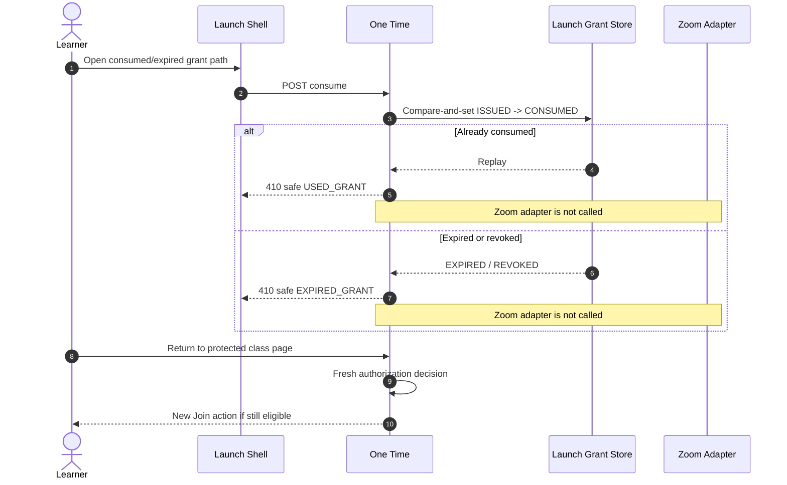
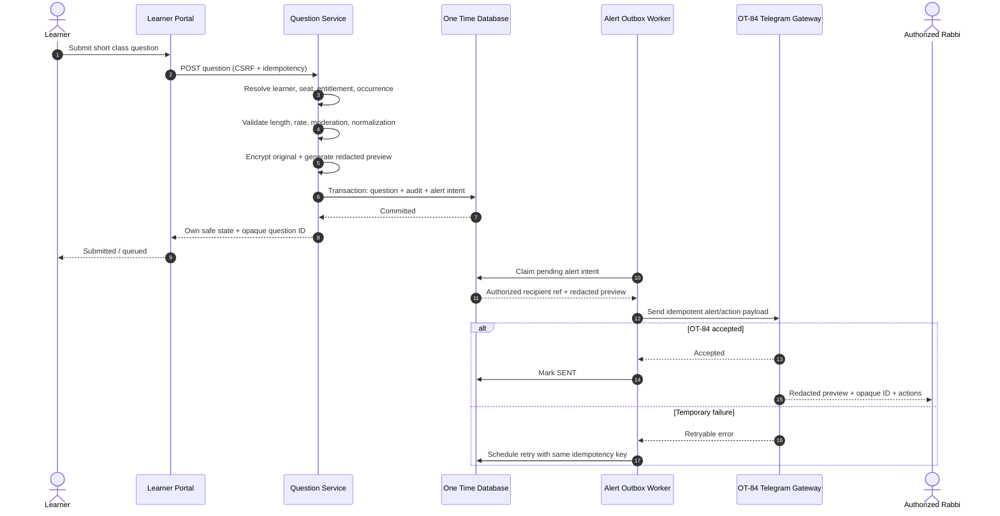
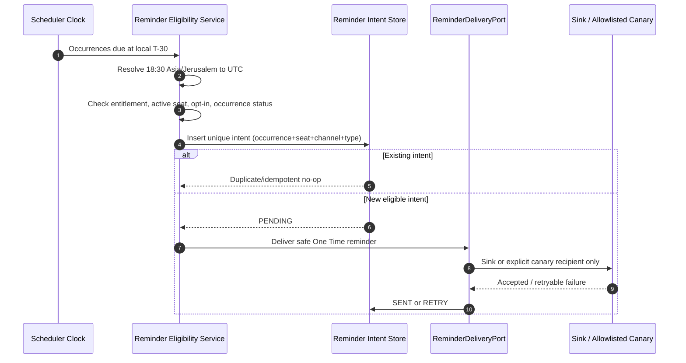
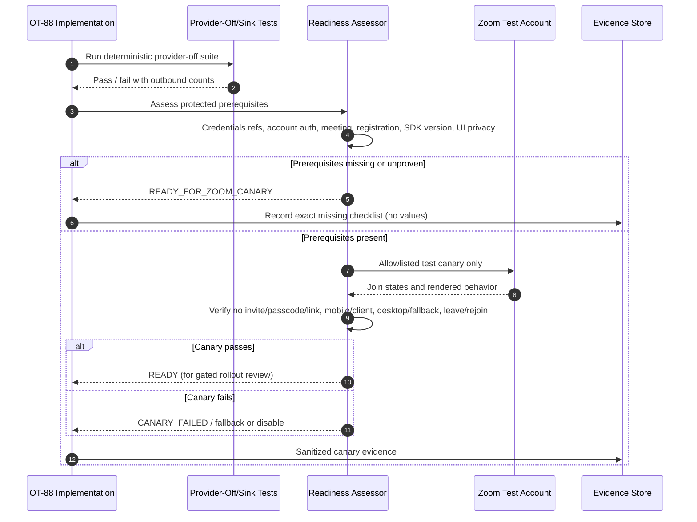
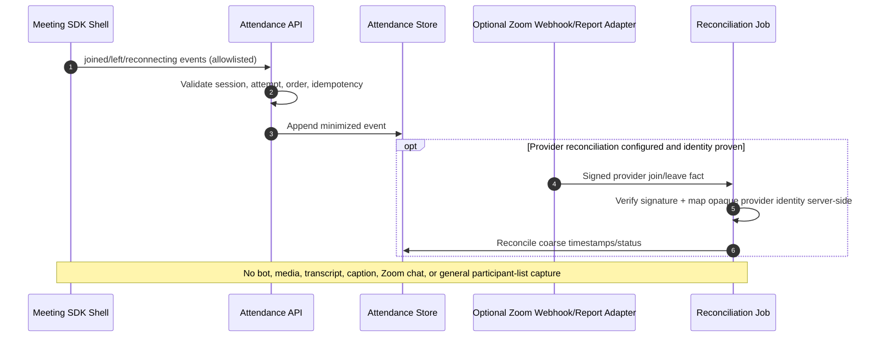

# OT-88 Sequence Diagrams

All provider credentials below are conceptual server-side values. They must not appear in ordinary portal responses, logs, URLs, analytics, Telegram, or committed evidence.

## 1. Protected learner join

### Text sequence

1. The learner opens the authenticated portal.
2. One Time resolves the learner from the session, not from request parameters.
3. The next-class query evaluates seat, entitlement, occurrence, revocation, and provider readiness, and returns safe state only.
4. The learner presses `Join Class`.
5. One Time reauthorizes and atomically issues a short-lived, single-purpose launch grant bound to learner and occurrence.
6. The browser navigates to a same-origin launch shell using only the opaque grant handle.
7. The launch shell performs a same-origin POST to consume the grant.
8. One Time atomically changes the grant from `ISSUED` to `CONSUMED` after repeating all policy checks.
9. One Time selects mobile client view, verified desktop component view, or client fallback.
10. The server-side Zoom adapter resolves encrypted meeting/registrant fields and generates a participant-role Meeting SDK JWT.
11. A no-store bootstrap response returns only the minimum SDK fields to the isolated launch shell. It never returns a raw join URL.
12. The shell invokes the Meeting SDK, drops application references to the bootstrap object, and emits minimized attendance transitions.
13. Leave or end destroys the SDK client and returns to a safe One Time page. Rejoin starts a new grant flow.

```mermaid
sequenceDiagram
    autonumber
    actor L as Learner
    participant P as One Time Portal
    participant A as Authorization/Entitlement
    participant G as Launch Grant Store
    participant S as Isolated Launch Shell
    participant Z as Server Zoom Adapter
    participant M as Zoom Meeting SDK
    participant T as Attendance Telemetry

    L->>P: GET protected next class
    P->>A: Resolve session learner + seat + entitlement + occurrence
    A-->>P: Safe readiness / canJoin
    P-->>L: Occurrence-safe card (no provider fields)

    L->>P: POST Join Class (CSRF + idempotency)
    P->>A: Reauthorize learner and occurrence
    A-->>P: Allow
    P->>G: Issue 90s JOIN_CLASS grant + attempt
    G-->>P: Opaque grant handle
    P-->>L: Same-origin launch path only

    L->>S: Navigate to launch shell
    S->>P: POST consume grant (same origin, no-store)
    P->>G: Atomic ISSUED -> CONSUMED
    G-->>P: Consumed once
    P->>A: Re-check session, seat, entitlement, window, revocation, rate
    A-->>P: Allow + selected view policy
    P->>Z: Resolve registrant/meeting; generate role=0 SDK JWT
    Z-->>P: Minimum SDK join fields (server-restricted)
    P-->>S: Sensitive no-store bootstrap (no raw join URL)
    S->>M: init/join using in-memory fields
    S->>S: Drop application references
    M-->>S: waiting / joined / reconnect / leave / ended
    S->>T: Allowlisted attempt events
    T-->>S: Accepted/idempotent
    S-->>L: App-owned state and safe leave route
```

## 2. Grant replay, expiry, and leave/rejoin

### Text sequence

- A second consume of the same grant never reaches the Zoom adapter.
- An expired or revoked grant never generates a new SDK signature.
- Leaving does not preserve provider fields or re-open the consumed grant.
- The learner must return to the protected portal and obtain a new authorization decision.



## 3. Student question submission and OT-84 alert

### Text sequence

1. The authenticated learner submits a short question for the active occurrence.
2. One Time resolves learner and occurrence from server state and verifies entitlement/seat.
3. The service validates content, idempotency, rate limits, and moderation rules.
4. The original is encrypted; a redacted preview and opaque question ID are created.
5. The database transaction stores the question, audit event, and alert outbox intent.
6. An asynchronous worker sends only the redacted preview to the authorized Rabbi identity through OT-84.
7. Retries use the same idempotency key and cannot duplicate the question or moderation transition.
8. The learner sees only their own safe state.



## 4. Rabbi Telegram action and moderation deep link

### Text sequence

- OT-84 authenticates the configured Rabbi Telegram identity and forwards a signed/verified action.
- One Time applies an idempotent state transition.
- `Feature next` updates only the One Time queue and may create a safe instruction for the Rabbi to use normal Zoom host controls.
- It does not invoke Zoom.
- `Open moderation` mints a separate short-lived Rabbi-only grant. It never uses a learner cookie/session.

```mermaid
sequenceDiagram
    autonumber
    actor R as Rabbi in Telegram
    participant T as OT-84 Gateway
    participant M as Question Moderation Service
    participant Q as Question Store
    participant F as ZoomFeatureParticipantPort
    participant D as Rabbi Moderation Page

    R->>T: Tap Feature next / Answered / Dismiss
    T->>M: Verified actor + opaque question ID + idempotency key
    M->>Q: Authorize Rabbi and lock question/occurrence
    Q-->>M: Current state
    M->>Q: Apply idempotent transition + audit
    alt Feature next
        M->>F: requestFeatureParticipant(selection)
        F-->>M: UnsupportedDisabled
        M-->>T: Selected in One Time; use normal host controls
    else Answered or Dismiss
        M-->>T: State updated
    end
    T-->>R: Safe confirmation

    R->>T: Open Rabbi moderation
    T->>M: Verified open request
    M->>M: Mint short-lived Rabbi-only deep-link grant
    M-->>T: One Time moderator URL (no learner session)
    T-->>R: Open moderation link
    R->>D: Authenticate/consume moderator grant
    D->>M: Read authorized question details
    M-->>D: Rabbi-only content and controls
```

## 5. Reminder scheduling at 18:30 Asia/Jerusalem

### Text sequence

1. The scheduler finds occurrences whose T-30 instant is due, resolving from the occurrence’s timezone snapshot.
2. Eligibility is checked for each active named learner seat and approved destination.
3. A unique reminder intent prevents duplicates across retries or multiple scheduler instances.
4. External delivery is sink-backed by default.
5. A real canary may target only an explicit allowlist.
6. Copy tells the learner to open One Time and never contains a provider URL or grant.



## 6. Provider readiness and Zoom canary

### Text sequence

- Readiness is more than “environment variables exist.”
- Provider-off tests run first and are mandatory.
- A real canary runs only with protected test credentials, test meeting/account, explicit allowlist, and UI privacy checks.
- Missing prerequisites produce `READY_FOR_ZOOM_CANARY`, not an unsafe join path.



## 7. Attendance reconciliation without media capture

### Text sequence

- Browser events create minimized application attendance telemetry.
- Optional provider webhooks/reports may reconcile coarse join/leave facts only when identity correlation is proven.
- Neither path captures Zoom media, transcripts, captions, chat, or participant lists for general analytics.


