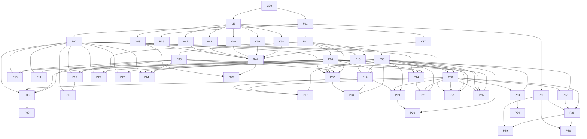
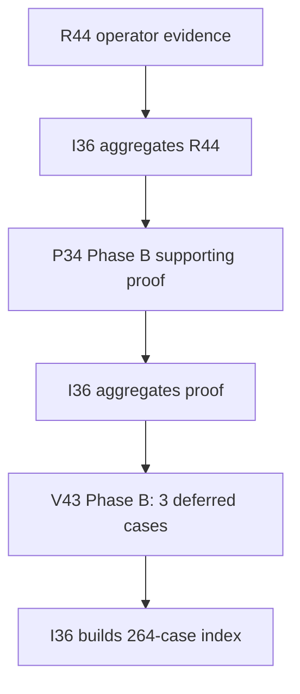

# Complete Task Dependency Graph

`start_after` controls when a branch may start. `merge_after` is the acyclic
full-implementation merge order. `candidate_integration_partners` names
cross-feature seams I36 reconciles before freeze but is deliberately
non-ordering. `acceptance_after` blocks final candidate proof only.

## Start graph



I36 additionally requires every F01–F07 and P08–P35 task to be
`implementation_ready`, merged in `merge_after` order, and every named
candidate-integration seam reconciled before the immutable candidate freezes.
V37–V43 all start from that same frozen candidate.

## Post-operator phase graph



The exact gates are
`operator_accepted_and_evidence_aggregated` →
`phase_b_postoperator_proof_aggregated` →
`phase_b_candidate_verified_passed_and_aggregated`.

## Final certification and release graph

```mermaid
flowchart TD
  R45A["R45 Phase A: case 265"] --> PASSCase passes?
  PASS -- Yes --> E45A["I36 builds 265/265 index"]
  PASS -- No --> BLOCK["R45 blocked decision"]
  E45A --> GATEAuthority and gates valid?
  GATE -- Yes --> CUT["R45 Phase B cutover"]
  GATE -- No --> BLOCK
  CUT --> FINAL["I36 final evidence merge"]
  BLOCK --> FINAL
  FINAL --> CLOSE["C00: done or release_blocked"]
```

The cutover path requires `certification_evidence_ready` followed by
`certification_passed_and_aggregated`. The blocked path never requires
265 passed. Both paths end with `release_decision_recorded`; C00 alone records
global `done` or `release_blocked`.

## Complete dependency table

| Task | Wave | Start after | Required start state | Full merge after | Candidate integration partners (non-ordering) | Candidate acceptance after |
|---|---:|---|---|---|---|---|
| C00 | 0 | — | — | — | — | — |
| F01 | 1 | C00 | C00:operational | — | — | — |
| F02 | 2 | F01 | F01:interface_ready_integrated | F01 | — | — |
| F03 | 3 | F02 | F02:interface_ready_integrated | F02 | F07 | — |
| F04 | 3 | F02 | F02:interface_ready_integrated | F02 | F03 | — |
| F05 | 3 | F02 | F02:interface_ready_integrated | F02 | F03 | — |
| F06 | 4 | F04, F05 | F04:interface_ready_integrated, F05:interface_ready_integrated | F04, F05 | F03 | — |
| F07 | 2 | F01 | F01:interface_ready_integrated | F01 | — | — |
| P08 | 5 | F03, F04, F06, F07 | F03:interface_ready_integrated, F04:interface_ready_integrated, F06:interface_ready_integrated, F07:interface_ready_integrated | F03, F04, F06, F07 | P25, P27 | — |
| P09 | 6 | P08 | P08:interface_ready_integrated | P08 | F06, P27, P30 | — |
| P10 | 4 | F03, F04, F07 | F03:interface_ready_integrated, F04:interface_ready_integrated, F07:interface_ready_integrated | F03, F04, F07 | P32 | — |
| P11 | 4 | F05, F07 | F05:interface_ready_integrated, F07:interface_ready_integrated | F05, F07 | P10, F06, P22, P24, P26, P33 | — |
| P12 | 4 | F03, F04, F07 | F03:interface_ready_integrated, F04:interface_ready_integrated, F07:interface_ready_integrated | F03, F04, F07 | P16, P32 | — |
| P13 | 5 | P12, F07 | P12:interface_ready_integrated, F07:interface_ready_integrated | P12, F07 | P15, P22, P24, P26 | — |
| P14 | 4 | F03, F04, F07 | F03:interface_ready_integrated, F04:interface_ready_integrated, F07:interface_ready_integrated | F03, F04, F07 | P16, P21, P22, P23, P26 | — |
| P15 | 3 | F02, F07 | F02:interface_ready_integrated, F07:interface_ready_integrated | F02, F07 | F03 | — |
| P16 | 5 | F04, F05, P15 | F04:interface_ready_integrated, F05:interface_ready_integrated, P15:interface_ready_integrated | F04, F05, P15 | P12, P14 | — |
| P17 | 6 | F05, F06, P16 | F05:interface_ready_integrated, F06:interface_ready_integrated, P16:interface_ready_integrated | F05, F06, P16 | P23, P28 | — |
| P18 | 6 | F05, P16, P32 | F05:interface_ready_integrated, P16:interface_ready_integrated, P32:interface_ready_integrated | F05, P16, P32 | F03, P17 | — |
| P19 | 6 | F05, F06, P16 | F05:interface_ready_integrated, F06:interface_ready_integrated, P16:interface_ready_integrated | F05, F06, P16 | P33 | — |
| P20 | 7 | F05, P19 | F05:interface_ready_integrated, P19:interface_ready_integrated | F05, P19 | F06, P33 | — |
| P21 | 5 | F05, F06, P14 | F05:interface_ready_integrated, F06:interface_ready_integrated, P14:interface_ready_integrated | F05, F06, P14 | P20, P23, P26 | — |
| P22 | 4 | F02, F05, F07 | F02:interface_ready_integrated, F05:interface_ready_integrated, F07:interface_ready_integrated | F02, F05, F07 | P14, P18, P21, P32 | — |
| P23 | 4 | F05, F07 | F05:interface_ready_integrated, F07:interface_ready_integrated | F05, F07 | P17, P21, P22 | — |
| P24 | 4 | F03, F04, F05, F07 | F03:interface_ready_integrated, F04:interface_ready_integrated, F05:interface_ready_integrated, F07:interface_ready_integrated | F03, F04, F05, F07 | F06, P22 | — |
| P25 | 5 | F04, F05, F06, F07 | F04:interface_ready_integrated, F05:interface_ready_integrated, F06:interface_ready_integrated, F07:interface_ready_integrated | F04, F05, F06, F07 | P08, P28 | — |
| P26 | 5 | F03, F04, F05, F06 | F03:interface_ready_integrated, F04:interface_ready_integrated, F05:interface_ready_integrated, F06:interface_ready_integrated | F03, F04, F05, F06 | P13, P14, P25, P28 | — |
| P27 | 5 | F04, F06 | F04:interface_ready_integrated, F06:interface_ready_integrated | F04, F06 | P08, P09 | — |
| P28 | 6 | F06, P27, P31 | F06:interface_ready_integrated, P27:interface_ready_integrated, P31:interface_ready_integrated | F06, P27, P31 | P17, P25, P26 | — |
| P29 | 7 | P28, P31 | P28:interface_ready_integrated, P31:interface_ready_integrated | P28, P31 | P25, P26 | — |
| P30 | 7 | P28, P31 | P28:interface_ready_integrated, P31:interface_ready_integrated | P28, P31 | P09, P25, P26, P29 | — |
| P31 | 2 | F01 | F01:interface_ready_integrated | F01 | F03, P28, P29, P30 | — |
| P32 | 4 | F02, F03, F04, F05, F07 | F02:interface_ready_integrated, F03:interface_ready_integrated, F04:interface_ready_integrated, F05:interface_ready_integrated, F07:interface_ready_integrated | F02, F03, F04, F05, F07 | F06, P10, P12, P18, P22 | — |
| P33 | 5 | F05, F06 | F05:interface_ready_integrated, F06:interface_ready_integrated | F05, F06 | P17, P19, P20, P21, P24, P25, P26, P27, P28, P29, P30 | — |
| P34 | 6 | P33 | P33:interface_ready_integrated | P33 | P35 | R44 |
| P35 | 2 | F01 | F01:interface_ready_integrated | F01 | F04, F06, P27, P33 | — |
| I36 | 1 | C00 | C00:operational | — | F01, F02, F03, F04, F05, F06, F07, P08, P09, P10, P11, P12, P13, P14, P15, P16, P17, P18, P19, P20, P21, P22, P23, P24, P25, P26, P27, P28, P29, P30, P31, P32, P33, P34, P35 | — |
| V37 | 9 | I36 | I36:candidate_frozen | — | — | — |
| V38 | 9 | I36 | I36:candidate_frozen | — | — | — |
| V39 | 9 | I36 | I36:candidate_frozen | — | — | — |
| V40 | 9 | I36 | I36:candidate_frozen | — | — | — |
| V41 | 9 | I36 | I36:candidate_frozen | — | — | — |
| V42 | 9 | I36 | I36:candidate_frozen | — | — | — |
| V43 | 9 | I36 | I36:candidate_frozen | — | — | — |
| R44 | 10 | V37, V38, V39, V40, V41, V42, V43 | V37:candidate_verified_passed_and_aggregated, V38:candidate_verified_passed_and_aggregated, V39:candidate_verified_passed_and_aggregated, V40:candidate_verified_passed_and_aggregated, V41:candidate_verified_passed_and_aggregated, V42:candidate_verified_passed_and_aggregated, V43:preoperator_cases_passed_and_aggregated | — | P34 | — |
| R45 | 11 | R44, V43 | R44:operator_accepted_and_evidence_aggregated, V43:phase_b_candidate_verified_passed_and_aggregated | — | — | — |

## Runtime interpretation

- A dependency may publish a checksum-bound `interface_ready` checkpoint to satisfy a contract start gate.
- I36 must merge that checkpoint into `codex/v21-integration`; C00 then records
  an exact `authorized_start_sha` containing every required interface.
- No worker starts from a moving branch name.
- Workers read the queue and task registry from fetched
  `origin/codex/v21-control`, never a stale worktree copy.
- External provider/legal/deployment gates are separate and are listed in `EXTERNAL-AUTHORITY-MATRIX.yaml`.
